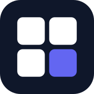

<div align="center">



# Protask

**A self-hosted workspace, project & GTD task manager — with multi-views, a Kanban board, calendars, and an Excalidraw overview canvas.**

A local-first, installable (PWA) alternative to Akiflow / Todoist that runs on _your own_ Supabase + Vercel.

[](./LICENSE)


</div>

> [!IMPORTANT]
> **Protask is a single-instance app.** It has **no login and no row-level security** — one Supabase instance = one user (or a small, trusted group sharing the same data). It is **not** multi-tenant. Run your own instance; don't point untrusted users at a shared one. (Multi-user auth/RLS is on the [roadmap](#roadmap).)

## ✨ Features

- **Hierarchy** — Workspace ▸ Phase ▸ Project ▸ Task ▸ subtasks (checklist tree).
- **Multi-views, everywhere** — view any workspace or project as a **Table** (group by status / label / project / nested Phase·Project), a **Board** (Kanban: 백로그 / 시작전 / 진행중 / 완료, derived from dates + Someday), or a **Calendar**. Full drag-and-drop, keyboard arrow navigation, and `←/→` tab switching.
- **GTD workflow** — Inbox quick-capture (`Ctrl+K`, Korean natural-language dates) → Today / Scheduled / Someday. Dual dates (do-date + deadline), overdue grouping, recurring tasks. **Today** has both a list and a **section board** view.
- **Overview canvas** — a per-workspace Excalidraw whiteboard + notes to map the big picture.
- **Calendar** — month/week, drag tasks onto days, workspace/project filters, and a two-way Google Calendar overlay (drag a Google event to another day and it's rescheduled in Google too).
- **Local-first & PWA** — optimistic edits with a serial sync outbox; installable and offline-capable.
- **MCP server** — `mcp/project_board_mcp_v2.py` lets AI agents read & write the board.

## 📸 Screenshots

<table>
  <tr>
    <td width="50%"><br/><sub><b>Project — Kanban board</b></sub></td>
    <td width="50%"><br/><sub><b>Calendar with side panel & filters</b></sub></td>
  </tr>
  <tr>
    <td width="50%"><br/><sub><b>Scheduled — upcoming by date</b></sub></td>
    <td width="50%"><br/><sub><b>Today — section board view</b></sub></td>
  </tr>
</table>

## 🚀 Quick start (self-host)

```bash
git clone https://github.com/procpalee/protask.git
cd protask
npm install
cp .env.example .env      # set your Supabase URL + anon key
npm run dev               # http://localhost:5173
```

**Set up the database** — create a project at [supabase.com](https://supabase.com), then in **SQL Editor** run the migrations in order:

```
supabase/migrations/0001_init.sql
supabase/migrations/0002_custom_sections.sql
supabase/migrations/0003_gtd.sql
supabase/migrations/0004_workspace_color.sql
```

Put the project's **URL** and **anon key** (Supabase → Settings → API) into `.env`, then create your first workspace in the sidebar.

## ☁️ Deploy (Vercel)

[](https://vercel.com/new/clone?repository-url=https://github.com/procpalee/protask)

Import the repo into Vercel and add the environment variables `VITE_SUPABASE_URL` and `VITE_SUPABASE_ANON_KEY` (plus `VITE_GOOGLE_CLIENT_ID` for Google Calendar). Protask is a Vite SPA — Vercel auto-detects the build, and pushes to `main` auto-deploy.

## 📅 Google Calendar (optional)

1. Google Cloud Console → create an **OAuth Web Client ID**; add your origins (`https://your-app.vercel.app`, `http://localhost:5173`).
2. Frontend: set `VITE_GOOGLE_CLIENT_ID`.
3. Token proxy (`api/google-token.ts`, a Vercel function): set server env `GOOGLE_CLIENT_ID`, `GOOGLE_CLIENT_SECRET` (optionally `APP_ORIGINS` to restrict CORS). For local dev, set `VITE_API_BASE` to your deployed URL.

Leave `VITE_GOOGLE_CLIENT_ID` blank to disable the integration.

## 🧱 Tech stack

Vite · React 19 · TypeScript · Tailwind v4 · zustand · @dnd-kit · Excalidraw · Supabase (normalized schema, no realtime — serial outbox sync) · vite-plugin-pwa · Vercel serverless.

## 🗺️ Roadmap

- **Multi-user hosting** — Supabase Auth + per-row `user_id` + Row-Level Security + login UI (currently single-instance only).

## 📄 License

[MIT](./LICENSE) © 2026 procpalee
